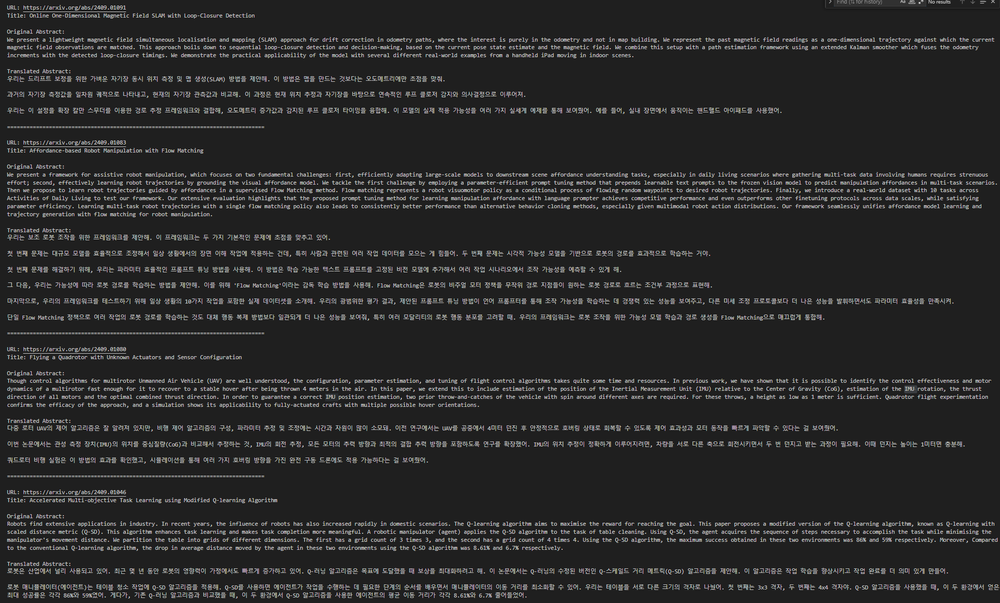

# arxiv_gpt_korean_translator
- using openai api 

## How to use 
- if you want to translate the new (of today) one automatically
    - `$ python3 translate_arxiv_new.py RO gpt-4o-mini YOUR_KEY`
    - `$ python3 translate_arxiv_new.py CV gpt-4o-mini YOUR_KEY`
    - __TODO: make this process automatically runs via GitHub-action__
- if you want to parse recent k items
    - `$ python3 translate_arxiv_recent.py RO gpt-4o-mini YOUR_KEY --num_max 200`
  
## The price (apprx.)
- I've used gpt-4o-mini (mini is important!), translated 169 papers' abstracts, and spent nearly $ 0.05.
- It's very reasonable and affordable (if you use mini) to summarize the 5 days of Robotics pastweek papers < 200 from https://arxiv.org/list/cs.RO/recent?skip=0&show=2000

## The example result 
- 
